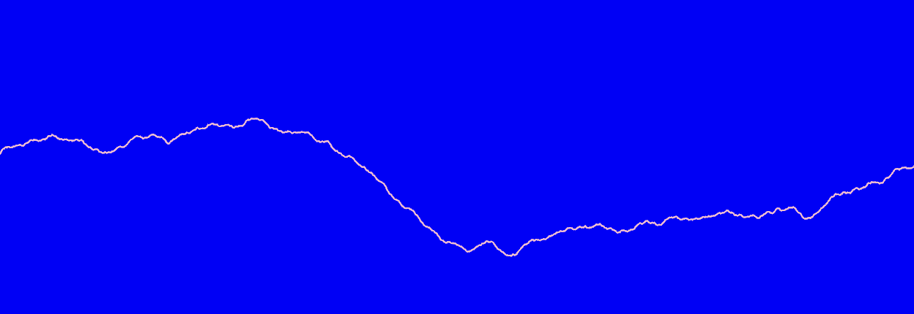
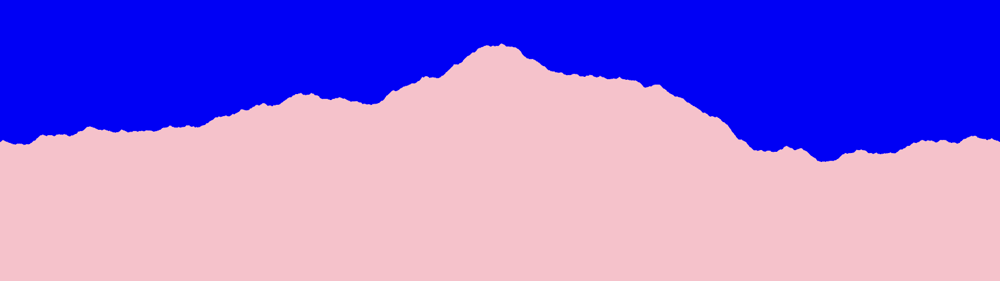

+++
title = "Creative Coding: Generating Banner Images"
author = "Steve Troetti"
date = 2024-02-20
updated = 2024-02-20
description = "First post about generating profile banner images in Rust with Nannou."

[taxonomies]
tags = ["rust", "nannou", "creative-coding", "banner-gen"]
+++

# Creative Coding: Generating Banner Images

Shortly after [revitalizing](@/blog/back-to-blogging/index.md) this blog, I also
decided to join Mastodon as a way to provide updates on my blogging journey.
As I was working on getting a verified badge for my site URL, I noticed the
conspicuous absence of a banner image on my profile.
I had my profile picture ready-to-go, but I've never needed a banner image before.
What did I decide to do? Well, write some code of course!

Below, I'll talk through library/framework selection, my general thought process,
and describe how I arrived at the (very) rough implementation I did.
If you just want to see the code, that's [here](https://github.com/SteveXCIV/banner-gen).

## Picking a Theme

Ok, so I decided to generate some banner art.
The question then is: _what_ do I want to generate?
I decided for now to keep it nice and simple, and reach for the tried and true
Midpoint Displacement algorithm - in two dimensions, you might see this called
the "Diamond-Square algorithm" ([wiki](https://en.wikipedia.org/wiki/Diamond-square_algorithm)).

Midpoint Displacement is a fairly low-effort way to get some decent looking
mountains.
Since it's a fractal algorithm, it works well for generating visuals without an
obvious cyclic pattern.
This tends to make better looking mountain silhouettes, than say, a composition
of sinunsoids, which would appear much more regular.

A developer by the name of Paul Martz wrote up an excellent description of the
algorithm in an article called "Generating Random Fractal Terrain".
Unfortunately, the website hosting this article seems to have gone offline
some time ago.
Luckily, [archive.org](https://web.archive.org/web/20160322002558/http://www.gameprogrammer.com/fractal.html) has plenty of captures.
I probably **would not** trust any code downloads linked there to be valid, but
the textual descriptions are still quite good.

Restating, I think, is one of the best ways to understand a concept, so I'll
outline the algorithm in TL;DR fashion here:

- Start with a pair of points; at the min and max X-coordinate of your image, respecively
- Repeat some `N` number of times:
  - For each pair of points:
    - Add a new point between the two, and displace this point on the Y-axis by some displacement amount
    - Reduce the magnitude of the displacement amount using some smoothing factor

## Midpoint Displacement in Rust

Once I settled on what I wanted to generate, it was time to get some hands-on-keyboard
time.
One thing I really like to think about whenever I'm doing a project, in any language,
is what the language and its ecosystem offers.
When I first began this project, I went through a similar process with Rust.
At the onset, I thought it might be neat to use pattern matching to recursively
generate splits of line segments into smaller segments.

### Initial Brainstorm

I brainstormed something like this:

```rust
pub enum Path {
    Segment(f32, f32),
    Node(Path, Path),
}
```

Now, if you're an experienced Rustacean, you'll probably see a problem with this
approach.
If you're new to Rust, the issue might be lost on you because it's quite subtle.
One of the things that Rust programmers need to be cognizant of is the _size_ of
data types.
The compiler needs to be able to determine, at compile time, how much memory
every instance of a given data type needs to allocate.
Let's take a closer look at our implementation and try to figure that out.

So, for the case of a `Segment`, determining the data size is quite simple,
since it's two 32-bit floats, and those have a fixed size.

Now then, what about the memory required for a `Node`?
We could look at the simplest possible `Node`, which would look something like:

```rust
Path::Node(Path::Segment(0.0, 0.0), Path::Segment(0.0, 0.0))
```

Well, then we have a problem.
Since we could technically create a `Path` with of infinitely nested `Node`s,
it's simply _not possible_ to determine the size in this case.
The upper bound of our data type's size is infinite, and the compiler cannot
write an instruction to allocate infinite memory.
In fact, if we try to compile, the compiler helpfully informs us that this is
the case:

```
error[E0072]: recursive type `Path` has infinite size
 --> src/lib.rs:1:1
  |
1 | pub enum Path {
  | ^^^^^^^^^^^^^
2 |     Segment(f32, f32),
3 |     Node(Path, Path),
  |          ---- recursive without indirection
  |
help: insert some indirection (e.g., a `Box`, `Rc`, or `&`) to break the cycle
  |
3 |     Node(Box<Path>, Path),
  |          ++++    +

For more information about this error, try `rustc --explain E0072`.
```

The compiler also helpfully proposes a fix for us, using some _indirection_.
What this means, in other words, is to structure the data type in such a way
that a `Node` takes up a fixed size, by heap-allocating the inner `Path`s.
This turns them into pointers, which have a fixed size.

Ultimately, I decided against doing this.
My reasoning was that I didn't think this design was actually going to provide
me as much value as I initially thought.
I might revisit this at a later point, but it was a fun diversion.

### The Actual Approach

I ended up going with something a little more "traditional", for lack of a
better term.
This approach looks and feels a lot like what you might see in C++, Java, or
other well-known languages.
It's also not all that heavy on Rust language features, and has some
panicking code sprinkled in, but that's all a future refactor waiting to happen.

For starters, I sketched out what I'd need to implement this algorithm.
I landed on:

- a number of `steps` (this is `N` in the pseudocode above)
- an `initial_displacement`, or how much noise there should be on the first recursive step
- a `smoothness` value, or how much to reduce displacement per recursive level

That landed me on this function signature:

```rust
fn compute_points<R: Rng>(
  rng: &mut R,
  steps: u32,
  initial_displacement: f32,
  smoothness: f32
) -> Vec<f32>
```

Let's unpack this.
We see here that our function takes the three parameters mentioned above, as well
as some `rng` (more on that shortly), and it returns a vector of `f32`.
As for implementation, we roughly want to do something like:

- start with an empty vector with enough capacity for `steps` number of subdivisions
- populate the initial endpoints with a value (these will be the start and end of the vector)
- repeat `steps` number of times:
  - compute the midpoint for each pair of points
  - displace the midpoint by a random amount, bounded by the current displacement
  - reduce the displacement amount using `smoothness`

Reading this over, we can see that we need some source of (pseudo-)randomness in
order to generate displaced midpoints.
That's where our parameter `rng` comes in, it's our source of (pseudo-)randomness.
The function signature includes this `<R: Rng>` - that's called a **trait bound**
in Rust.
What we're telling the compiler is that this function is generic over some type
`R`, and only types that implement the trait `Rng` are valid.
What is `Rng`, you may ask? It's the core trait in the very popular
[`rand`](https://crates.io/crates/rand)
crate in the Rust ecosystem.

Ok, now that we've squared that away, let's talk implementation details.
Since I planned on implementing this as a recursive function, I went with the
tried and true pattern of creating a "wrapper" function that computes all the
initial state, and an additional function that does the recursive step.
I sketched out this signature for the recursive step, which I called `fill`:

```rust
fn fill<R: Rng>(
  rng: &mut R,
  points: &mut Vec<Option<f32>>,
  i: usize,
  j: usize,
  steps: u32,
  displacement: f32,
  smoothness: f32
)
```

A couple of things to note here:

This function takes in a mutably-referenced `Vec<Option<f32>>` instead of a `Vec<f32>`.
I did this to leverage Rust's `Option` type to denote to-be-computed points,
rather than using a sentinel value like `0.0`.
This, in my opinion, is a better design because the compiler forces us to address
both the `None` and `Some(...)` cases explicitly, rather than just assuming a value
exists.
Also, floating point equality has a bunch of gotchas associated with it, which I
wanted to sidestep, and `0.0` is a perfectly valid value for a point, so there's
no guarantee this algorithm couldn't accidentally overwrite previously computed
points in the case of a bug.
The function also takes two indices called `i` and `j` - these will control which
subsection of the vector each recursive call operates on.

Finally, I wrote a quick helper function to compute the index of a midpoint,
given an `i` and `j` index.
This is pretty straightforward so I'm just going to drop the implementation in here:

```rust
fn midpoint(i: usize, j: usize) -> usize {
    i + (j - i) / 2
}
```

Finally, following my textual descriptions above, I implemented the other two
functions as follows:

```rust
fn fill<R: Rng>(
    rng: &mut R,
    points: &mut Vec<Option<f32>>,
    i: usize,
    j: usize,
    steps: u32,
    displacement: f32,
    smoothness: f32,
) {
    if steps == 0 {
        return;
    }
    let mid = midpoint(i, j);
    if mid == i || mid == j {
        return;
    }
    let i_val = points[i].expect("no value at i index");
    let j_val = points[j].expect("no value at j index");
    let mid_val = (i_val + j_val) / 2.0 + rng.gen_range(-displacement..=displacement);
    points[mid] = Some(mid_val);
    let new_displacement = displacement * 2.0f32.pow(-smoothness);
    fill(rng, points, i, mid, steps - 1, new_displacement, smoothness);
    fill(rng, points, mid, j, steps - 1, new_displacement, smoothness);
}

fn compute_points<R: Rng>(
    rng: &mut R,
    steps: u32,
    initial_displacement: f32,
    smoothness: f32,
) -> Vec<f32> {
    let size = 2usize.pow(steps) + 1;
    let mut points: Vec<Option<f32>> = vec![None; size];
    let i = 0usize;
    let j = points.len() - 1;
    points[i] = Some(0.0);
    points[j] = Some(0.0);
    fill(
        rng,
        &mut points,
        i,
        j,
        steps,
        initial_displacement,
        smoothness,
    );
    points
        .into_iter()
        .filter_map(std::convert::identity)
        .collect::<Vec<_>>()
}
```

I won't deep dive into every line here, but I'll pick out a couple of specifics
to go over.

I compute `new_displacement` like this:

```rust
let new_displacement = displacement * 2.0f32.pow(-smoothness);
```

This is borrowed from the math in Paul Martz' blog post that I linked above.
If you're like me though, you like to work out the math as you translate it to
code to make sure you understand what you're doing.
This computation is fairly trivial, but it's still a thing I like to do, personally.

Since $x^0 = 1, \space \forall x$ and $x^{-y} = {1 \over {x^y}}$, we can quickly
compute the following test values:

| `smoothness` | Multiplicative Factor |
| :----------- | --------------------: |
| 0.0          |                   1.0 |
| 0.5          |                ~0.707 |
| 1.0          |                   0.5 |

Ok, so this computation maps `smoothness` to a value between `0.0` and `1.0`,
and as `smoothness` grows, the resulting computation shrinks, resulting in
`new_displacement` being less-than-or-equal to `displacement`.
Makes sense.

Then, there's also this little section at the bottom of `compute_points`:

```rust
points
  .into_iter()
  .filter_map(std::convert::identity)
  .collect::<Vec<_>>()
```

This is a use of Rust's powerful iterators.
In short, this function is doing the following:

- `into_iter()` converts our `Vec<Option<f32>>` into an iterator;
  this method **consumes** the vector, meaning we are **taking ownership**
  of its valeus
- `filter_map(...)` operates on an iterator, each element is mapped to an
  `Option`, and those which yield a `Some(...)` value are retained
  - `std::convert::identity` is the identity function - since our values are
    already `Option<T>`, this works out quite elegantly
- `collect()` collects our iterator back into a collection, we specify a vector here

This is one of the things I really love about Rust - this small expression is
doing so much, and yet, it remains quite readable.

Now with the core algorithm out of the way, I need a way to display things on
screen.

## Enter Nannou

[Nannou](https://nannou.cc/) is a creative coding framework for Rust.
If you've ever played aroubnd with something like Processing, Nannou is
conceptually similar.
If this is all new to you, the TL;DR is: the Nannou framework allows you to
quickly and easily spin up programs that produce audiovisual effects.
Nannou can also do some cool stuff with lasers and other kinds of AV hardware,
but I'm not well-versed enough to write about any of that.
In my opinion, rapid prototyping is pretty important when your output is visual.
You really want to be able to get something on the screen and build on it as
quickly as possible.
Nannou makes it very easy to get started with getting something on the screen,
via their sketch concept.
Then, once you want more functionality, you can use the regular Nannou app.

I'll skip over copy-pasting a ton of boilerplate and just link to a commit here,
commit [ce5415b](https://github.com/SteveXCIV/banner-gen/commit/ce5415b71038f0ba0b55a9a7e6297f6b9f2502b5)
has the first iteration of a nannou sketch to draw mountains on screen.

It's barebones, and I personally don't think it's all that pretty, but it works.
It generates something that looks like this, more or less:



## Filling in the Outline

This outline looks vaguely mountain-like, but it's _just an outline_.
To fill it in, I add a handful of extra points outside the bounds of the screen,
like so:

```rust
let left_cap = iter::once((rect.left() - 50.0, rect.bottom() * 20.0));
let right_cap = iter::once((rect.right() + 50.0, rect.bottom() * 2.0));
let points = model.points.iter().cloned().enumerate().map(|(i, y)| {
    let x = (i as f32 * width_per_step) + rect.left();
    (x, y * 100.0)
});
draw.polygon()
    .color(PINK)
    .points(left_cap.chain(points).chain(right_cap));
```

Combining `iter::once()` and `chain()` makes it quick and easy to do this.
I also added basic keyboard interaction to avoid recompiling every time I wanted
a new image.
Pressing `space` now regenerates the mountain image.
That code is in commit [34b4e59](https://github.com/SteveXCIV/banner-gen/commit/34b4e5928744e9ab2238c9751230beb507be2e4e).
This generates mountains that look a bit more.. _mountainy_.



## Multiple Layers

Now that I had some vaguely mountain-shaped polygon on my screen, I decided to
expand the program a bit more to support _layers_.
The idea is that a `Layer` struct could wrap a set of points as well as a
"baseline" Y coordinate.
This would allow me to draw multiple mountain ranges stacked on top of each other,
giving the illusion of distance, or something like that.
While I was at it, I also added in the [`colorgrad`](https://crates.io/crates/colorgrad)
crate for some nice gradients, and wrote a very simple wrapper type to allow me
to convert `colorgrad` colors into Nannou colors.
I sample the gradients based on which layer I'm rendering in order to get
evenly-spaced colors for each layer.
That code can be found in commit [51b18ea](https://github.com/SteveXCIV/banner-gen/commit/51b18ea4d75b3ae73470a91e9da341c8f8e1bdc4).

## Wrapping it Up (for now)

Finally, I added three very small final adjustments for the time being.
First, I renamed some variables and parameters to read more easily.
Secondly, I adjusted the default screen size to match the dimensions I was after.
Third, I made it so pressing the `S` key saves the image to the current
working directory.
When all was said and done, I ended up with the following image, which,
at the time of writing, adorns my Mastodon profile:


This version of the code is commit [56e5fe3](https://github.com/SteveXCIV/banner-gen/commit/56e5fe30d328e8ae0611859d035381bfe2964d47).

## Final Notes

Before I sign off on this post, I want to address a couple of issues with this
code.
This project is very much so what my CS 4500 professor would have called a
**"garage program"**.
Essentially, it's in a rough state, it looks like something I whipped up in my
garage.
Frankly, it kind of is, just sub "garage" out for "living room couch".

Here's a list of things I definitely want to come back and address to make this
program more useful and more.. complete?

- there are no tests anywhere in sight; the UI is probably the heaviest lift
  here, but there's no reason the basic algorithm can't be tested
- everything is shoved into a `main.rs` file; the program is quite small now,
  but keepng everything in `main.rs` is not scalable
- it's not possible to specify any parameters; there aren't "magic numbers",
  but if the parameters can be named, they can be converted into command line args
  - one could imagine specifying steps, displacement, smoothness, gradient, etc.
- there's no non-interactive mode, you need to run the GUI to generate an image
- this is kind-of a limitation of Nannou because it's built around a windowing
  system, however, it is possible to run one frame then exit
- perhaps in the future, there could be more image generators than just "mountains"

If you've made it this far, thanks so much for reading!
I want to continue blogging about this project as I build it out, stay tuned for
more.
